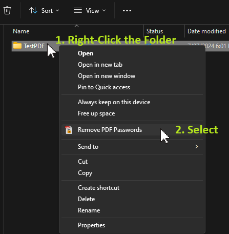

#   Remove PDF Passwords 

A simple and effective tool to remove passwords from multiple PDF files within a folder. 

The core program can be run independently but is more effective with the Windows Explorer's Right-click Context Menu

 


## Features

* **Batch Processing:** Quickly decrypt all password-protected PDFs in a specified directory.
* **Customizable Output:** Choose to overwrite original files or create new files with the "_decrypted" prefix.  
* **User-Friendly:** Simple installation process and an intuitive context menu integration with Windows Explorer.
* **Secure:** Password is not stored after execution.


## Requirements

**Windows:** 
- This tool is designed for Windows and requires the .NET 8.0 runtime.

**PDFsharpCore Library:** 
- This library is used for PDF manipulation. It is automatically installed by the installer.


## Installation

**Download:** 
- Download the latest binary release **_PDFPasswordRemoverWinx64Installer.exe_** from the [Releases](./../../releases) page.

**Install:** 
- Double-click the installer and follow the on-screen instructions. 

> [!NOTE]
> ### What is installed?
> 1. The program and its dependencies in the Windows **_Program File_** or **_<Users>\AppData\Local\Programs_** directory depending on the permissions used at the time of install.
> 2. Creates the following registry keys for the context menu entry in Windows Explorer:
> ```
> [HKEY_CLASSES_ROOT\Directory\shell\Remove PDF Passwords]
> Icon="{app dir}\PDFPasswordRemover.ico"
>
> [HKEY_CLASSES_ROOT\Directory\shell\Remove PDF Passwords\command]
> @="{app dir}\PDFPasswordRemover.exe" "%V"
> ```

### Usage

**Right-Click:** 
- Right-click on a folder containing PDF files in the Windows Explorer.

**Select:** 
- Choose "Remove PDF Passwords" from the context menu.

 

**Enter Password:** 
- Enter the password to decrypt the PDFs.

 

## How to compile the source code?
The core working functionality is in the [Program.cs](Program.cs) file and the [registry keys](./Installer/ContextMenu.reg). 

The remaining files are for:
- Visual Studio Code - the IDE and build 
- [Inno Setup](/Installer/PDFPasswordRemover.iss) - to create the installer (see  [https://jrsoftware.org/isinfo.php](https://jrsoftware.org/isinfo.php) for more details)
- Git related

Compile the code as follows: 
1. In Visual Studio Code open the project folder as  `And Folder to Workspace..` or `Open Folder...`
2. Press: `Ctrl + Shift + P`
3. Select `Task: Run Task` (See [tasks.jason](./.vscode/tasks.json))
4. Select `Inno Setup: Compile Script` (See [PDFPasswordRemover.iss](./Installer/PDFPasswordRemover.iss))

This should throw errors for any missing dependencies 😄 (e.g. **PDFsharpCore Library:**) !

> [!TIP]
> Use your favourite GenAI to debug and fix the errors 😊.

When it all works the installer file `PDFPasswordRemoverWinInstaller.exe` is created in the `.\Installer\Winx64Installer\` folder. 


## WARNING: Use the code with caution.

> [!CAUTION]
> **Disclaimer**
> - This tool is intended for legal use only. Use it responsibly and respect copyright laws.
> - The author is not responsible for any misuse or damage caused by this software.

> [!IMPORTANT] 
> **Contributing**
> - Contributions are welcome! Please feel free to submit bug reports, feature requests, or p= ull requests.
>
> **License**
> - This project is licensed under the MIT License. See the LICENSE file for details.
